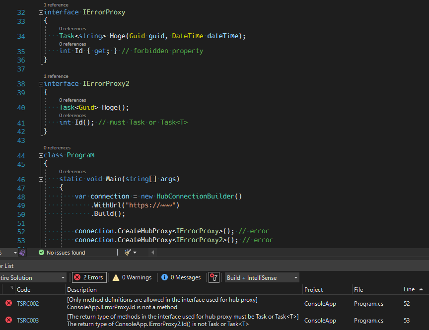

#  TypedSignalR.Client

C# Source Generator to create strongly typed SignalR Client.

# Install
```
dotnet add package Microsoft.AspNetCore.SignalR.Client
dotnet add package TypedSignalR.Client
```

# Introduction

The C # SignalR Client is untyped.
To call a Hub (server-side) function, you must specify the function defined in Hub as a string.

```cs
connection.InvokeAsync("HubMethod")
```

You also have to manually determine the return type.

```cs
var ret = await connection.InvokeAsync<SomeType>("HubMethod")
```

Registering a client function called by the server also requires a string, and the argument types must be set manually.

```cs
Connection.On<string, DateTime>("ClientMethod", (str, dateTime) => {});
```

Therefore, if you change the code on the server-side, the modification on the client-side becomes very troublesome. The main cause is that it is not strongly typed.

This TypedSignalR.Client (Source Generator) aims to generate a strongly typed SignalR Client by sharing the server and client function definitions as an interface. 

# API
This Source Generator provides three extension methods and one interface. 

```cs
static class Ex
{
    THub CreateHubProxy<THub>(this HubConnection source);

    IDisposable Register<TReceiver>(this HubConnection source, TReceiver receiver);

    (THub HubProxy, IDisposable Subscription) CreateHubProxyWith<THub, TReceiver>(this HubConnection source, TReceiver receiver);
}

// An interface for observing SigalR events.
interface IHubConnectionObserver
{
    Task OnClosed(Exception e);
    Task OnReconnected(string connectionId);
    Task OnReconnecting(Exception e);
}
```

Use it as follows. 

```cs
HubConnection connection = ...;

var hub = connection.CreateHubProxy<IHub>();
var subscription = connection.Register<IReceiver>(new Receiver);
```

# Usage
Suppose you have the following interface defined:
```cs
public class UserDefine
{
    public Guid RandomId { get; set; }
    public DateTime Datetime { get; set; }
}

// The return type of the client-side method must be Task. 
public interface IClientContract
{
    // Of course, user defined type is OK. 
    Task SomeClientMethod1(string user, string message, UserDefine userDefine);
    Task SomeClientMethod2();
}

// The return type of the method on the hub-side must be Task or Task <T>. 
public interface IHubContract
{
    Task<string> SomeHubMethod1(string user, string message);
    Task SomeHubMethod2();
}

class Receiver1 : IClientContract
{
    // impl
}

class Receiver2 : IClientContract, IHubConnectionObserver
{
    // impl
}
```

## Client
It's very easy to use. 
```cs
HubConnection connection = ...;

var hub = connection.CreateHubProxy<IHubContract>();
var subscription1 = connection.Register<IClientContract>(new Receiver1());

// When an instance of a class that implements IHubConnectionObserver is registered (Receiver2 in this case), 
//the method defined in IHubConnectionObserver is automatically registered regardless of the type argument. 
var subscription2 = connection.Register<IClientContract>(new Receiver2());

// or
var (hub2, subscription3) = connection.CreateHubProxyWith<IHubContract, IClientContract>(new Receiver());

// Invoke hub methods
hub.SomeHubMethod1("user", "message");

// Unregister the receiver
subscription.Dispose();
```

## Server
By the way, using these definitions, you can write as follows on the server side (ASP.NET Core). 
`TypedSignalR.Client` is not nessesary.

```cs
using Microsoft.AspNetCore.SignalR;

public class SomeHub : Hub<IClientContract>, IHubContract
{
    public async Task<string> SomeHubMethod1(string user, string message)
    {
        await this.Clients.All.SomeClientMethod1(user, message, new UserDefineClass());
        return "OK!";
    }

    public async Task SomeHubMethod2()
    {
        await this.Clients.Caller.SomeClientMethod2();
    }
}
```
## Recommendation
I recommend that these interfaces be shared between the client and server sides, for example, by project references.

```
server.csproj => shared.csproj <= client.csproj
```

# Compile-time error support
This source generator has some restrictions, including those that come from the server side. 

- Type argument of `CreateHubProxy/CreateHubProxyWith/Register` method must be an interface.
- Only define methods in the interface used for `HubProxy/Receiver`. 
  - Properties should not be defined. 
- The return type of the method in the interface used for `HubProxy` must be `Task` or `Task<T>`.
- The return type of the method in the interface used for `Receiver` must be `Task`.

It is very difficult for humans to properly comply with these restrictions. Therefore, it is designed so that the compiler (Roslyn) looks for the part where the constraint is not observed at compile time and reports a detailed error. Therefore, no run-time error occurs. 



# What kind of source code will be generated?
The source generator checks the type argument of a method such as'CreateHubProxy/Register' and generates the following code based on it.

If we call the methods `connection.CreateHubProxy<IHubContract>()` and `connection.Register<IClientContract>(new Receiver())`, the following code will be generated (simplified here). 

```cs
public static partial class Extensions
{
    private class HubInvoker : IHubContract
    {
        private readonly HubConnection _connection;

        public HubInvoker(HubConnection connection)
        {
            _connection = connection;
        }

        public Task<string> SomeHubMethod1(string user, string message)
        {
            return _connection.InvokeCoreAsync<string>(nameof(SomeHubMethod1), new object[] { user, message });
        }

        public Task SomeHubMethod2()
        {
            return _connection.InvokeCoreAsync(nameof(SomeHubMethod2), System.Array.Empty<object>());
        }
    }

    private static CompositeDisposable BindIClientContract(HubConnection connection, IClientContract receiver)
    {
        var d1 = connection.On<string, string UserDefine>(nameof(receiver.SomeClientMethod1), receiver.SomeClientMethod1);
        var d2 = connection.On(nameof(receiver.SomeClientMethod2), receiver.SomeClientMethod2);

        var compositeDisposable = new CompositeDisposable();
        compositeDisposable.Add(d1);
        compositeDisposable.Add(d2);
        return compositeDisposable;
    }

    static Extensions()
    {
        HubInvokerConstructorCache<IHubContract>.Construct = static connection => new HubInvoker(connection);
        ReceiverBinderCache<IClientContract>.Bind = BindIClientContract;
    }
}
```
The generated code is used through the API as follows. 
```cs
public static partial class Extensions
{
    // static type caching
    private static class HubInvokerConstructorCache<T>
    {
        public static Func<HubConnection, T> Construct;
    }

    // static type caching
    private static class ReceiverBinderCache<T>
    {
        public static Func<HubConnection, T, CompositeDisposable> Bind;
    }

    public static THub CreateHubProxy<THub>(this HubConnection connection)
    {
        return HubInvokerConstructorCache<THub>.Construct(connection);
    }

    public static IDisposable Register<TReceiver>(this HubConnection connection, TReceiver receiver)
    {
        if(typeof(TReceiver) == typeof(IHubConnectionObserver))
        {
            // special subscription
            return new HubConnectionObserverSubscription(connection, receiver as IHubConnectionObserver);;
        }

        var compositeDisposable = ReceiverBinderCache<TReceiver>.Bind(connection, receiver);

        if (receiver is IHubConnectionObserver hubConnectionObserver)
        {
            var subscription = new HubConnectionObserverSubscription(connection, hubConnectionObserver);
            compositeDisposable.Add(subscription);
        }

        return compositeDisposable;
    }
}
```

# Demo
First, launch server.
Then access it from your browser and open the console(F12). 

```
git clone https://github.com/nenoNaninu/TypedSignalR.Client.git
cd sandbox 
dotnet run --project SignalR.Server/SignalR.Server.csproj
```

Execute the console app in another shell. 

```
cd sandbox 
dotnet run --project SignalR.Client/SignalR.Client.csproj
```
